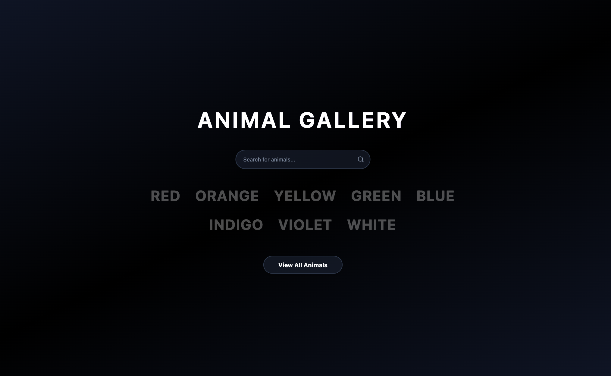

# Animal Gallery



## Overview
Animal Gallery is a full-stack web application that allows users to browse, create, update, and delete animal entries organized by color. The application features an interactive interface with search functionality, achievement tracking, and responsive design.

### Features
- 🎨 **Color-organized browsing** - Animals categorized by 8 different colors
- 🔍 **Live search** - Search across all animals with real-time results
- ✨ **CRUD Operations** - Create, read, update, and delete animal entries
- 🏆 **Achievement System** - Unlock achievements for CRUD operations
- 📱 **Responsive Design** - Works seamlessly on desktop and mobile
- 🖼️ **Image Upload** - Support for custom animal images

### Tech Stack
**Frontend:**
- React TypeScript
- Tailwind CSS
- React Router
- Vite

**Backend:**
- Spring Boot
- PostgreSQL
- JPA/Hibernate
- Java 21

## Prerequisites
- **Java 21** or higher
- **Node.js** (v16 or higher)
- **PostgreSQL database** (Neon.tech recommended)
- **Git**

## Installation & Setup

### 1. Clone the Repository
```bash
git clone https://github.com/amarixdev/Animal-Gallery-FullStack.git
cd Animal-Gallery-FullStack
```

### 2. Backend Setup (Spring Boot)

#### Configure Database
1. Create a PostgreSQL database on [Neon.tech](https://neon.tech)
2. Copy your connection string
3. Update `src/main/resources/application.properties`:
```properties
spring.application.name=animal-gallery

spring.datasource.url=YOUR_CONNECTION_STRING
spring.datasource.username=YOUR_USERNAME
spring.datasource.password=YOUR_PASSWORD

spring.jpa.hibernate.ddl-auto=update
spring.web.resources.static-locations=classpath:/static/,file:./uploads/
spring.servlet.multipart.max-file-size=10MB
spring.servlet.multipart.max-request-size=10MB
```

#### Run Backend
```bash
# From project root
./mvnw spring-boot:run
```

The backend will start on `http://localhost:8080`

### 3. Frontend Setup (React)

#### Install Dependencies
```bash
# Navigate to frontend directory
cd src/main/java/com/example/animal_gallery_FE

# Install dependencies
npm install
```

#### Configure Base URL
Update `src/util/BASEURL.ts` if needed:
```typescript
export const API_BASE_URL = 'http://localhost:8080/api';
export const BASE_URL = 'http://localhost:8080';
```

#### Run Frontend
```bash
npm run dev
```

The frontend will start on `http://localhost:5173`

## Project Structure
```
animal-gallery-BE/
├── src/main/java/com/example/animal_gallery_BE/
│   ├── animal/                     # Backend animal entity & services
│   └── AnimalGalleryBeApplication.java
├── src/main/java/com/example/animal_gallery_FE/
│   ├── src/
│   │   ├── components/            # Reusable React components
│   │   ├── pages/                 # Main application pages
│   │   ├── types/                 # TypeScript type definitions
│   │   ├── data/                  # Static data and configurations
│   │   └── util/                  # Utility functions
│   ├── public/
│   │   ├── images/                # Static animal images
│   │   └── audio/                 # Sound effects
│   └── package.json
└── uploads/                       # User-uploaded images
```

## Usage

### Getting Started
1. Visit `http://localhost:5173` after starting both servers
2. Browse animals by clicking on color words on the homepage
3. Use the search bar to find specific animals
4. Click "View All Animals" to see the complete gallery

### Adding Animals
1. Navigate to any color page (e.g., `/red`)
2. Click "Add New [Color] Animal"
3. Fill out the form with animal details
4. Upload an image and submit

### Managing Animals
- **View Details**: Click on any animal card
- **Update**: Click the "Update" button on animal detail pages
- **Delete**: Click the "Delete" button and confirm

### Achievement System
Unlock achievements by performing your first:
- **C**reate - Add your first animal
- **U**pdate - Modify an existing animal  
- **D**elete - Remove an animal

## API Endpoints
The backend provides RESTful endpoints for animal management:

- `GET /api/all` - Get all animals (with optional search)
- `GET /api/{color}/all` - Get all animals by color
- `GET /api/{color}/{id}` - Get specific animal
- `POST /api/{color}/create` - Create new animal
- `PUT /api/{color}/{id}/update` - Update animal
- `DELETE /api/{color}/{id}/delete` - Delete animal
- `POST /api/upload` - Upload image

## Development

### Frontend Development
```bash
cd src/main/java/com/example/animal_gallery_FE
npm run dev          # Start development server
npm run build        # Build for production
npm run preview      # Preview production build
```

### Backend Development
```bash
./mvnw spring-boot:run           # Run with Maven wrapper
./mvnw clean compile             # Clean and compile
./mvnw test                      # Run tests
```

## Contributing
1. Fork the repository
2. Create a feature branch (`git checkout -b feature/amazing-feature`)
3. Commit your changes (`git commit -m 'Add amazing feature'`)
4. Push to the branch (`git push origin feature/amazing-feature`)
5. Open a Pull Request

## License
This project is open source and available under the [MIT License](LICENSE).

## Support
For questions or issues, please open an issue on the GitHub repository.
